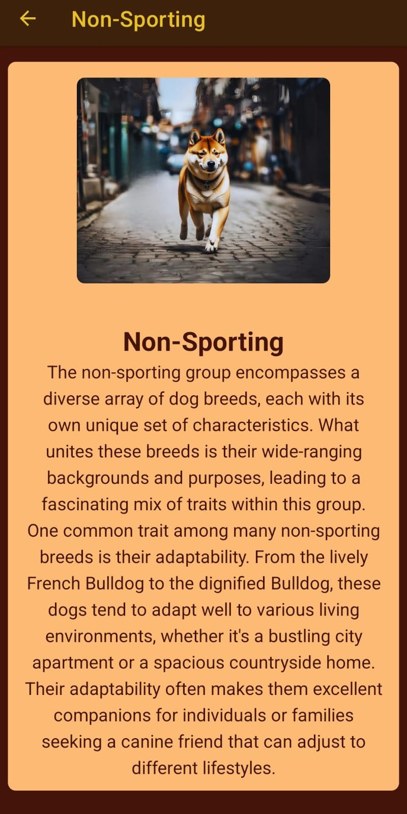

# Doggiepedia App

Doggiepedia App is a mobile application built with **React Native** that uses the [Doggiepedia](https://api.doggiepedia.org/) API to display information about different dog breeds.

## Features



- **Explore Dog Breeds**: Users can explore various dog breeds and get detailed information about each one.
- **Intuitive Interface**: The app is designed to be easy to use and navigate.

## Technologies Used

- **Mobile App**: [React Native](https://reactnative.dev/)
- **API**: [Doggiepedia API](https://api.doggiepedia.org/)

## How to Run the Project

### Prerequisites

- Node.js and npm installed
- Expo CLI installed

### Instructions

1. **Clone the repository**:
   ```bash
   git clone https://github.com/Fuwanto/react-native-doggiepedia.git
   ```
2. **Navigate to the project directory**:
   ```bash
   cd doggiepedia
   ```
3. **Install dependencies**:
   ```bash
   npm install
   ```
4. **Start the project on an emulator or physical device**:
   ```bash
   expo start
   ```