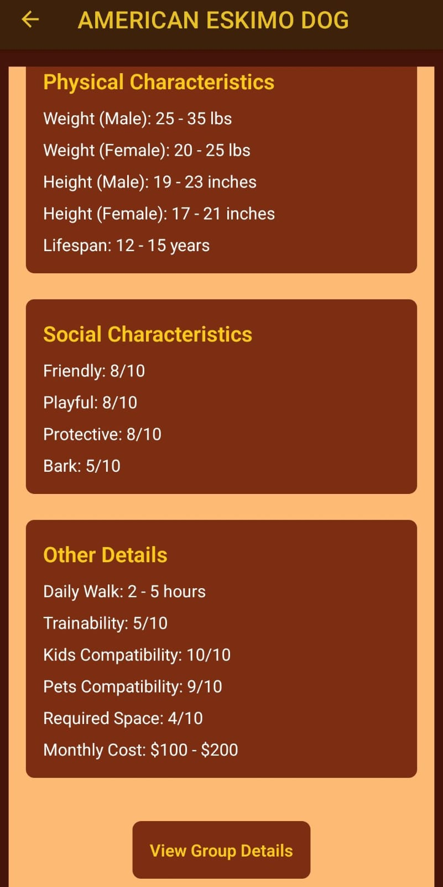

# Doggiepedia App

Doggiepedia App es una aplicación móvil construida con **React Native** que utiliza la API de [Doggiepedia](https://api.doggiepedia.org/) para mostrar información sobre diferentes razas de perros.

## Características



- **Explorar Razas de Perros**: Los usuarios pueden explorar diversas razas de perros y obtener información detallada sobre cada una.
- **Interfaz Intuitiva**: La aplicación está diseñada para ser fácil de usar y navegar.

## Tecnologías Utilizadas

- **Mobile App**: [React Native](https://reactnative.dev/)
- **API**: [Doggiepedia API](https://api.doggiepedia.org/)

## Cómo Ejecutar el Proyecto

### Prerrequisitos

- Node.js y npm instalados
- Expo CLI instalado

### Instrucciones

1. **Clonar el repositorio**:
   ```bash
   git clone https://github.com/Fuwanto/react-native-doggiepedia.git
   ```
2. **Navegar al directorio del proyecto**:
   ```bash
   cd doggiepedia
   ```
3. **Instalar las dependencias**:
   ```bash
   npm install
   ```
4. **Iniciar el proyecto en un emulador o dispositivo físico**:
   ```bash
   expo start
   ```
